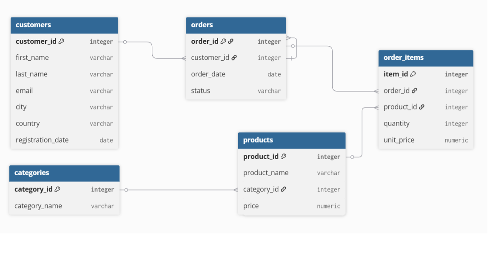

# E-Commerce Sales Analysis

SQL project analyzing sales data of an online store using **PostgreSQL**.

## Project Goal

Answer real business questions using SQL:
- How is revenue growing over time?
- Which products and categories generate the most revenue?
- Which customers are the most valuable?
- What is the customer retention rate?

## Database Structure

The database consists of 5 related tables:

| Table | Description |
|-------|-------------|
| `categories` | Product categories (8 categories) |
| `products` | Product catalog (40 products) |
| `customers` | Customer profiles (50 customers, 9 countries) |
| `orders` | Order history (78 orders, 2022–2025) |
| `order_items` | Individual items within each order |

## Analysis Overview

### Basic Analysis
- Total store revenue
- Orders count by year
- Top 5 products by revenue
- Revenue by product category
- Revenue and customers by country

### Advanced Analysis
- Loyal customers (2+ orders)
- Top months by revenue
- Average Order Value (AOV) by country

### Window Functions
- Customer ranking by revenue within each country using `RANK()`
- Cumulative revenue growth (Running Total)
- Month-over-month revenue comparison using `LAG()`

### Business Metrics
- **AOV** (Average Order Value) by month
- **Retention Rate** — 42% of customers made repeat purchases
- **LTV** (Lifetime Value) — average customer value: $507

### CTE Analysis
- Customer segmentation by spending (VIP / Regular / New)
- Revenue contribution by segment
- First purchase analysis — most popular entry products
- Days between first and second purchase (time to return)

## Key Findings

| Metric | Value |
|--------|-------|
| Total Revenue | $25,354.71 |
| Total Orders | 78 |
| Total Customers | 50 |
| Retention Rate | 42% |
| Average LTV | $507.09 |
| Best Month | September 2024 ($2,149.97) |
| Top Category | Electronics (58% of revenue) |
| Top Product | iPhone 14 ($3,999.96) |

## Tools & Skills

- **Database:** PostgreSQL
- **Tool:** DBeaver
- **SQL concepts:** JOIN, GROUP BY, HAVING, CASE WHEN, Subqueries, Window Functions (RANK, LAG, Running Total), CTE (Common Table Expressions)

## Author

**diana-data-analyst** | [GitHub](https://github.com/diana-data-analyst)
